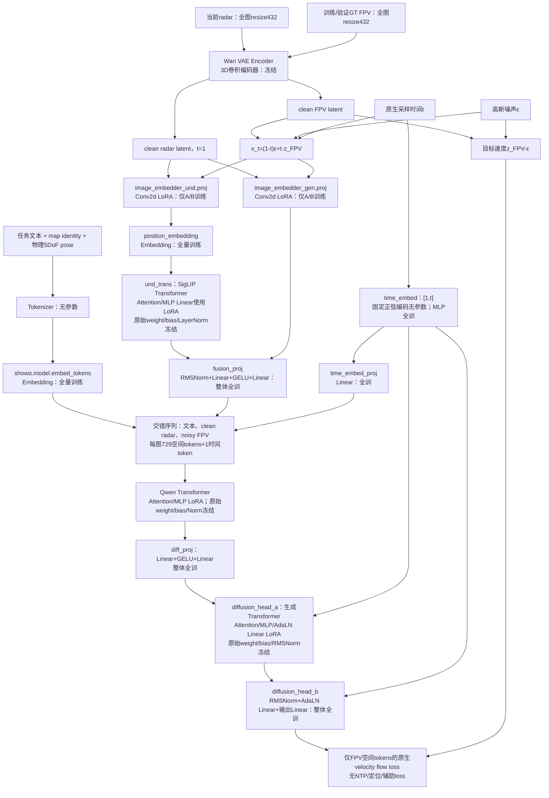
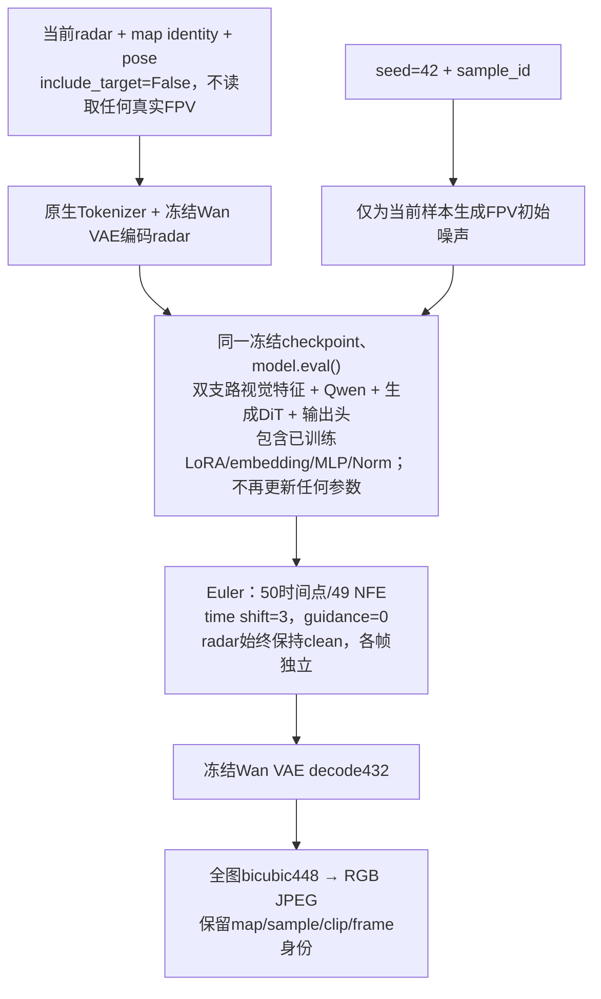

# Show-o2 Seen-10：设计决策与最终 aligned 方案

本文记录已经批准并实现的设计依据、模块职能、微调策略、实现边界与验收标准；日常命令、环境和当前状态统一见 [CSGO_SEEN10.md](CSGO_SEEN10.md)，日期化实施证据见 [CSGO_ALIGNED_VALIDATION.md](CSGO_ALIGNED_VALIDATION.md)。首次接入方案已归档到 [CSGO_BENCHMARK_V2_PLAN.md](CSGO_BENCHMARK_V2_PLAN.md)。

本配置对应用户最终批准的 **`aligned_v2_final`** 参数策略，默认配置仍为 `show-o2/configs/csgo_seen10_exp32gen_aligned.yaml`。它是 generation-only 基线，不增加定位、perception/auxiliary loss、numeric pose adapter 或时序模块。此次明确解冻视觉与文本 embedding 的要求覆盖此前“保持官方 warm-up 冻结名单”的中间方案。

调整前的 aligned 完整保留为 **`aligned_v1`**：配置 `show-o2/configs/csgo_seen10_exp32gen_aligned_v1.yaml`，启动时增加 `--finetuning-policy aligned_v1`。没有 policy 字段的历史 aligned 配置/checkpoint 按 v1 解释，不能静默升级为 v2。初次接入的 numeric-FiLM 实验仍是不加 `--experiment` 的默认旧命令，和 aligned_v1 不是同一个实验。

最终版采用独立 `_v2_final` 输出根；不覆盖旧 checkpoint、best/late 链接或预测。正式训练、全量生成和正式评测仍由用户手动启动。

## 1. 配方来源与横向对比

| 项目 | Show-o2 官方 downstream mixed modality | UniLIP exp32_gen | 本 aligned profile |
|---|---|---|---|
| 初始化 | 官方 Show-o2 / Wan2.1 | UniLIP 原基础模型 | 本地已校验官方 Show-o2-1.5B、Wan2.1；不读旧 CSGO checkpoint |
| 输入 | 交错文本与图像 | radar、map、5DoF pose | radar 经原生 VAE/视觉路径；map 和物理 pose 经文本 |
| 任务 | mixed-modal，NTP + flow | generation-only | 只对目标 FPV 计算原生 velocity flow loss |
| 有效 generation batch | 由官方启动布局决定 | 128 | 只约束 W × micro × accumulate = 128 |
| 训练预算 | 配置 max_train_steps=40000 | 实际 19500 updates | 19500 optimizer updates；2496000 源样本曝光 |
| LoRA | 仓库未提供可核实的稳定官方 LoRA recipe | LLM/DiT r32、generation connector r16；alpha64/dropout0.05 | Qwen、SigLIP、DiT 和两侧 Conv patch 投影均 r32/alpha64/dropout0.05 |
| vision / connector | warm-up 冻结 vision/Qwen，fusion 全训；后续全部解冻 | vision 与视觉—语言投影冻结；generation connector 使用 LoRA | 视觉 Transformer/Conv 使用 LoRA；位置 embedding 和 fusion 整体全训 |
| 其他生成模块 | 官方主要生成路径全量训练 | 显式全训 projector（含 bias）与 latent queries；DiT 内部分独立 MLP 仍 LoRA | 文本 embedding、时间/生成投影 MLP、整个输出头全训；Transformer 内 Norm/bias 冻结 |
| 优化器 | AdamW，1e-4，β=(0.9,0.999)，wd0 | AdamW，主 LR1e-4，wd0 | AdamW，同 β、wd0、eps1e-8；所有可训练组 peak LR1e-4 |
| scheduler | constant，warmup0 | warmup ratio0.003、cosine min1e-5 | 59 optimizer updates warmup、cosine min1e-5；最后一步1e-5 |
| radar / target 尺寸 | 原生432 / 432 | 224 / 448 | 432 / 432；最终整图 bicubic 到448 RGB JPEG |
| 图像处理 | resize、center crop、normalize | 确定性 resize，无随机增强 | 保留 bicubic、normalize；关闭破坏 pose-FOV 对齐的 crop |
| 保存 / 验证 | 官方周期保存 | 原实验不做 validation-best | 4000/8000/12000/16000/19500，每次完整5000条 validation |
| 主结果 | 原任务原规则 | final | late=19500；best仅补充 |

参考文件：`show-o2/configs/showo2_1.5b_downstream_mixed_modality_simple.yaml`、`show-o2/train_mixed_modality_simple.py`、`/home/jiahao/task/UniLIP/csgo_configs/exp32_gen.yaml`。exp32 是 joint generation+localization，仅作为次要对照；其约19550次更新不能替代 exp32_gen 的 generation-only 主对照。以上表格区分官方配置与实际结果，不把官方配置 batch 当成已测 global batch。

选择 LR 的原因：官方 downstream 与 exp32_gen 都使用1e-4 AdamW；没有可验证的官方 LoRA recipe，因此保留批准的 r32/alpha64/dropout0.05 及 warmup/cosine 下限。所有新增可训练组（包括 embedding）仍用同一1e-4峰值学习率，未擅自增加 embedding 专用 LR。没有进行测试集调参。本最终方案是明确的小模块白名单与架构适配，不是 exp32_gen 全部微调细节的逐项复刻；视觉解冻、全量文本 embedding 与432分辨率均须报告。

## 2. 原生条件流与分辨率选择

### 2.1 训练数据与特征流（最终版）

### 2.2 推理数据与特征流

这是文字指导的 image-conditioned generation/editing，不是有 mask 的局部 inpainting。输入 radar 和目标 latent 使用同一套官方双路径图像表征；没有直接新增一个 pixel-SigLIP 支路。每张图片是54×54 VAE latent、27×27 patch grid，加1个 time token。文本包含 map、x/y一位小数、z三位小数、角度转度后一位小数、地图 frozen z范围，信息格式与参考短指令一致。超过256 prompt tokens会报错，绝不截断 pose。

全四个split的87800条实际指令已用本地Qwen tokenizer检查：113–119 tokens，均低于256上限；此检查只读manifest与radar条件元数据，不读取测试FPV。

radar全局地图和 FPV 视野都不做 flip/crop/color augmentation。官方中心裁剪会改变非正方形 FPV 的视野而无可用相机内参同步修正，因此按“影响标签则关闭”规则禁用。视觉输入432与参考224的差异明确保留。native mixed-modal 条件始终保留，aligned CFG训练 dropout=0、guidance=0；未引入人工无条件分支。旧实验的数值 pose 路径不变。

## 3. 最终可训练模块审计（aligned_v2_final）

下表前缀均相对于 wrapper；总参数按实际加载后的独立 Parameter 计数，不包含外置 frozen VAE。

| 参数前缀 / 职能 | 策略 | 可训练参数 |
|---|---|---:|
| `backbone.showo.model.embed_tokens.*` | 整个文本 Embedding 全训 | 232,963,584 |
| `backbone.position_embedding.*` | 位置参数表全训 | 839,808 |
| `backbone.und_trans.layers.{0..25}.self_attn.{q,k,v,out}_proj` 和 `.mlp.{fc1,fc2}` | 156个 Linear LoRA targets | 16,746,496 |
| `backbone.image_embedder_und.proj` | Conv2d LoRA；原始 weight/bias 冻结 | 38,912 |
| `backbone.image_embedder_gen.proj` | Conv2d LoRA；原始 weight/bias 冻结 | 51,200 |
| `backbone.fusion_proj.*` | RMSNorm + Linear + GELU + Linear，整个模块全训 | 6,493,824 |
| `backbone.showo.model.layers.{0..27}.self_attn.{q,k,v,o}_proj` 和 `.mlp.{gate,up,down}_proj` | 196个 LoRA targets，r32/alpha64/dropout.05 | 36,929,536 |
| `backbone.diffusion_head_a.{0..9}.self_attn.{q,k,v,o}_proj`、`.mlp.{gate,up,down}_proj`、`.adaLN_modulation.1` | 80个 LoRA targets，同上 | 18,677,760 |
| `backbone.time_embed.mlp.{0,2}`、`backbone.time_embed_proj` | full | 7,869,952 |
| `backbone.diff_proj.{0,2}` | full | 7,344,128 |
| `backbone.diffusion_head_b.*` | RMSNorm、AdaLN Linear、输出 Linear 整个模块全训 | 8,525,888 |
| Transformer 内原始 weight/bias/Norm、Qwen 末端 Norm、lm_head、其余参数、Wan VAE | frozen | 0 |

最终版 LoRA 合计72,443,904；full合计264,037,184；trainable=336,481,088。真实加载后base=3,063,740,640，注入后total=3,136,184,544，可训练比例约10.73%，不含外置 VAE。434个 targets = Qwen196 + DiT80 + SigLIP156 + Conv2d2。不得把 Transformer 内部 MLP 或 AdaLN Linear 拆出来全训。

LoRA 明确设置 `r=32, lora_alpha=64, lora_dropout=0.05, bias=none, lora_bias=false, init_lora_weights=true, use_rslora=false, use_dora=false`。完整全训模块包含其所有 Norm 参数和 bias；`bias=none` 只约束 LoRA 覆盖的原始层，不禁止全训模块训练 bias。

官方.bin中的 embedding/lm_head 共享存储，但现有加载器运行时暴露为两个独立 Parameter。最终版只训练输入 embedding，不执行词表 logits/NTP，不解冻未使用的 lm_head；如其他加载路径保留共享参数/存储，须隔离冻结的输出权重，不能让 embedding 更新隐式修改冻结头。audit记录 Parameter/存储共享关系。

每个trainable参数使用同一个 AdamW LR策略，optimizer不得包含任何frozen参数或重复参数。运行时保存完整 `parameter_audit.json`（精确名字、shape、dtype、状态、policy、LoRA与optimizer覆盖）。训练权重采用FP32 master、计算BF16，无 torch.compile。最终版视觉路径跟随 `model.train()/eval()`，LoRA dropout训练开启、验证/推理关闭；只有v1继续强制冻结视觉路径eval。参数冻结不等于 `no_grad()`，不得切断上游梯度。

### 3.1 五种配置对照

官训列顺序为 Stage1a/1b → Stage2a → Stage2b/2c；官微为 warm-up → 全解冻。官方两列是实际代码路径的参数状态对照，不表示它们使用相同 CSGO 数据流。

| 模块 | 调整后 aligned_v2_final | 调整前 aligned_v1 | 初次接入 CSGO | 官训 | 官微 |
|---|---|---|---|---|---|
| 文本 embedding | full | frozen | frozen | 冻结→冻结→全训 | 冻结→全训 |
| image_embedder_und.proj | Conv LoRA | frozen | frozen | 冻结→冻结→全训 | 冻结→全训 |
| position_embedding | full | frozen | frozen | 冻结→冻结→全训 | 冻结→全训 |
| und_trans | Attention/MLP LoRA | frozen | frozen | 冻结→冻结→全训 | 冻结→全训 |
| image_embedder_gen.proj | Conv LoRA | full | full | 全训→冻结→全训 | 全训→全训 |
| fusion_proj（含Norm） | full | frozen | full | 全训→全训→全训 | 全训→全训 |
| time_embed.mlp | full | full | full | 全训→未入optimizer→未入optimizer | 全训→全训 |
| time_embed_proj、diff_proj | full | full | full | 全训→冻结→全训 | 全训→全训 |
| Qwen Transformer | LoRA | LoRA | frozen | 冻结→冻结→全训 | 冻结→全训 |
| diffusion_head_a | LoRA | LoRA | full | 全训→冻结→全训 | 全训→全训 |
| diffusion_head_b | 整体full（含Norm） | Linear full、Norm frozen | full | 全训→冻结→全训 | 全训→全训 |
| Wan VAE | frozen | frozen | frozen | 始终冻结 | 始终冻结 |
| RadarPoseFiLM | 不实例化 | 不实例化 | full | 无此模块 | 无此模块 |

v1仍是276个LoRA targets、79,445,056可训练参数、total=3,119,347,936；视觉/fusion/embedding冻结，生成Conv全训，输出头Norm冻结。保留其原始配置映射和历史恢复语义。新旧policy禁止跨版本加载或resume，切换策略须从官方基础权重建立新run。

### 3.2 规则与例外的边界

Transformer 内部的 attention、MLP 与 AdaLN Linear 一律归属于该 Transformer：只训练 LoRA A/B，原始权重、bias 和 Norm 冻结。独立的 fusion/time/diff projection MLP 整体全训，包含自身 bias/Norm。Embedding、Conv 和输出头并不是凭“模块小”自动解冻，而是用户最终明确指定的例外：文本/位置 Embedding 全训，两侧 patch Conv 使用 Conv2d LoRA，`diffusion_head_b` 整体全训。不得重新套用中间讨论的“所有视觉模块冻结”规则。

官方结构证据：[Show-o2 模块定义](show-o2/models/modeling_showo2_qwen2_5.py)、[官方 mixed-modality 冻结名单](show-o2/configs/showo2_1.5b_downstream_mixed_modality_simple.yaml)、[官方微调入口](show-o2/train_mixed_modality_simple.py)、[Stage 2 optimizer 分组](show-o2/train_stage_two.py)。官方 Stage 2 的 `time_embed.mlp` 未进入 optimizer 是代码行为，不等于有意设计的冻结策略；最终 aligned 已显式收录此组。精确 LoRA 匹配、全训白名单、共享权重隔离和参数统计以 [finetuning.py](show-o2/csgo_seen10/finetuning.py) 为准，不使用仅按后缀匹配的模糊注入。

## 4. 预算、条件与恢复的设计边界

- generation-only 与 UniLIP `exp32_gen` 对齐 128 条源样本/update、19,500 updates、2,496,000 次曝光（49.92 个完整数据 epoch）；两图槽、CFG 或 token 展开都不增加样本计数。默认 micro8、单卡累计16，不分别硬性限制两个因子；实际只检查 `world × micro × accumulation = 128`。
- 全局 source stream 跨 epoch 续接，不照搬其他项目“每 epoch 丢80条”的采样实现。终止条件是 optimizer updates，不是 epoch 数；scheduler/global step 同样按 optimizer update。
- 4000/8000/12000/16000/19500 保存并对完整5000条 validation 计算本模型原生 flow loss。`late/final` 主报告，`best` 补充；loss 不能跨架构比较，不使用测试指标选点。
- native interleaved 当前以同一空间网格批量组合 radar/target 两个 image slots；432 对应原生27×27 patch grid。选择432/432是已批准的原生配置差异，而不是声称 Show-o2 理论上不支持其他尺寸（legacy 已使用448）。分别用224/448需要改变现有两槽组装和特征长度处理，不在本方案内；最终保存整图resize448不能消除条件/生成原生分辨率差异。参见 [模型适配](show-o2/csgo_seen10/model.py) 与 [采样运行时](show-o2/csgo_seen10/runtime.py)。
- aligned 仅使用物理 pose 文本，不实例化数值 adapter；legacy 的归一化 FiLM 保留。官方确定性 bicubic/normalize 保留，影响视野标签的中心 crop 关闭；不增加随机增强或人工 CFG 分支。
- checkpoint 只在累计边界保存；policy、数据/基础模型/config、参数审计、backend、RNG 与 source cursor 一并约束恢复。同布局精确恢复与改变 batch 拆分后的继续训练不是同一种保证。旧 policy 缺字段解释为 v1；不得把历史 checkpoint 自动升级为最终版。

## 5. 已实现文件分工与兼容边界

| 文件（相对项目根） | 职责 |
| --- | --- |
| `show-o2/configs/showo2_1.5b_csgo_seen10.yaml` | 首次接入 legacy，保持原义 |
| `show-o2/configs/csgo_seen10_exp32gen_aligned.yaml` | 最终 `aligned_v2_final` 配方及独立输出根 |
| `show-o2/configs/csgo_seen10_exp32gen_aligned_v1.yaml` | 完整保留调整前 aligned 配方 |
| `show-o2/csgo_seen10/data.py` | manifest/split/calibration、数值/文本条件、resize 与测试 target 隔离 |
| `show-o2/csgo_seen10/model.py` | 官方权重、两槽原生生成图、legacy FiLM 与 aligned 无 adapter 分支 |
| `show-o2/csgo_seen10/finetuning.py` | policy、精确 LoRA targets、全训白名单、optimizer 审计、权重保存/加载 |
| `show-o2/csgo_seen10/aligned_training.py`、`show-o2/csgo_seen10/sampler.py` | 有效 batch、source stream、optimizer-step scheduler、完整验证、原子保存和恢复合同 |
| `show-o2/train_seen10.py` | legacy 训练及显式 aligned 分派 |
| `show-o2/infer_seen10.py`、`show-o2/csgo_seen10/runtime.py` | 独立采样 RNG、批量/缓存/Euler、JPEG 完整性、checkpoint/预测身份 |
| `show-o2/models/modeling_showo2_qwen2_5.py` | 图像生成跳过词表 logits、原生视觉/生成计算路径 |
| `scripts/run_csgo_seen10.sh` | legacy/v1/v2 路由、训练/推理/共享评测命令、dry-run 与隔离 smoke |
| `scripts/setup_csgo_seen10.sh`、`show-o2/requirements-csgo-seen10.txt` | 本机依赖与官方资产准备；不等同于通用跨服务器迁移工具 |
| `scripts/audit_aligned_parameters.py`、`scripts/verify_aligned_resume.py` | CPU 真权重审计/缩小图 backward、可信 checkpoint 的只读恢复对比 |
| `tests/test_csgo_aligned_*.py` 与原有 tests | 参数/LoRA、数据、source stream、恢复、启动器和旧行为回归 |

无 `--experiment` 的命令仍走 legacy；显式 experiment 默认 v2，附加 `--finetuning-policy aligned_v1` 才选择旧 aligned。各版本的 run/checkpoint/prediction/evaluation 分开，旧命令和旧链接不被改指向最终版。共享 evaluator 只被调用，不在目标项目复制指标实现。参考项目的 compile、模型结构、安装参数和实测数字不移植到 Show-o2。

## 6. 验收标准与资源风险

1. 三种入口的配置和输出根正确；dry-run 不创建训练/预测产物；非法 policy 或有效 batch 拒绝。保持 legacy 命令兼容。
2. Seen-10 四 split 的50000/5000/20000/12800条、200×64连续身份、selection/calibration 一致；推理 `include_target=False`，不得打开测试/相邻真实 FPV。
3. 完整参数审计：434个 LoRA targets、336,481,088可训练参数；11个组 LR 一致，frozen 不入 optimizer，无重复/漏收。Transformer base/Norm/bias 冻结，全训模块 Norm/bias 有梯度，embedding/lm_head 隔离；LoRA dropout 按 train/eval 切换。
4. loss 正确按 accumulation 缩放；每次更新128条真实源样本；跨 epoch、DataLoader 预取与 consumed cursor 不混淆；scheduler/global step 只在 update 边界前进。
5. 独立目录完成真实模型同布局2步训练，对照 step1→新进程恢复→step2；检查全部 trainable/frozen、optimizer/scheduler/AMP、RNG、source order、loss 和累计边界。CPU tiny 测试不能替代最终版全尺寸 GPU 恢复。
6. 记录最终版 micro8 完整反向/Adam 初始化后的显存与吞吐；多卡命令解析或 CPU/Gloo 不等于真实多 GPU 验收。
7. 同一 checkpoint 离散/连续各少量生成，448 RGB JPEG、sample/clip/frame 身份、完整性/断点恢复检查；拒绝跨 policy/checkpoint 混合。批量不改变初始噪声，但不承诺跨 batch 位级一致。
8. 共享 evaluator smoke 读取成功；明确 frame-only、时序指标和 FID/FVD 的覆盖。正式报告须满足完整覆盖，不能拿 smoke 数字选点或当论文结果。

已完成和未完成项以 [日期化验收记录](CSGO_ALIGNED_VALIDATION.md) 为证；最终版目前只有 CPU 回归、真实权重缩小图 backward 与 tiny 精确恢复，尚未完成全尺寸 GPU 端到端验收。常规 `smoke` 命令只跑1个 update及每任务1张图，不能单独满足上面的2步恢复对照要求。

最终版从79.45M增加到336.48M可训练参数，并增加视觉反向、文本 embedding 和对应 Adam 状态。历史 v1 的耗时、显存或 checkpoint 体积不得作为 v2 估算；最终版正式 ETA/磁盘预算待全尺寸短测后给出。micro8 是否可运行未验证，OOM 时减 micro、增 accumulation 保持128。双图长序列、确定性 backend 开销、432→448尺寸差异和 BF16跨 batch 数值差异需要披露。
